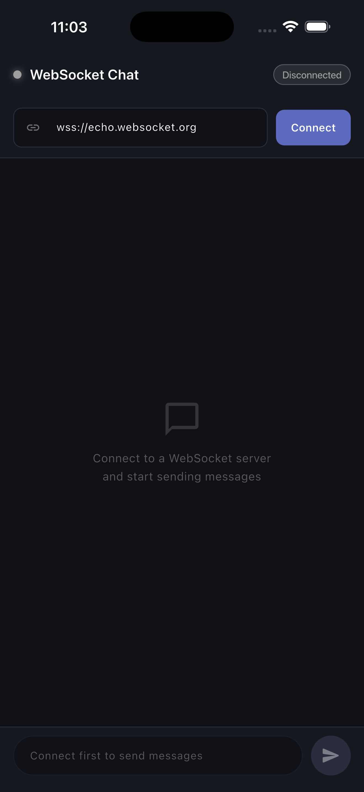
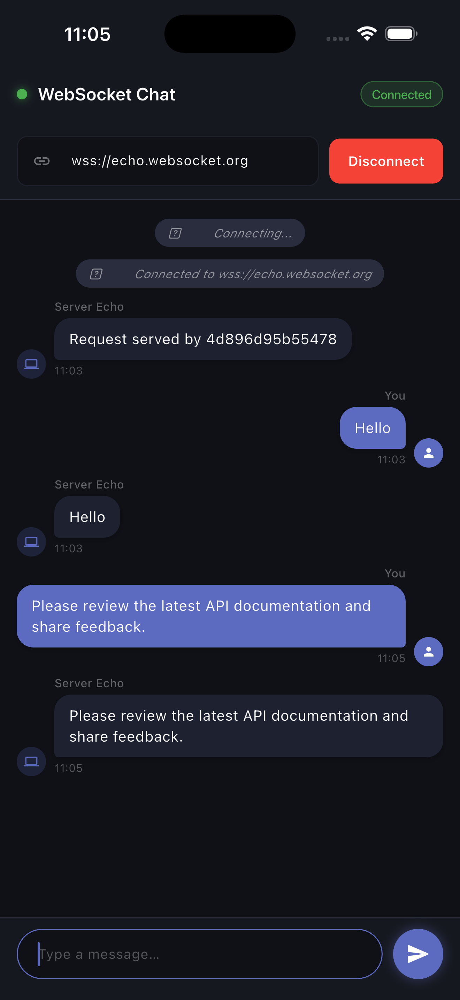

<div align="center">

# ⚡ WebSocket Chat Demo

**A real-time WebSocket chat app built with Flutter — clean architecture, live echo, and a sleek dark UI.**


</div>

---

## 📱 Screenshots

<div align="center">

| Disconnected | Connected & Chatting |
|:---:|:---:|
|  |  |

</div>

---

## ✨ Features

- 🔌 **Connect / Disconnect** to any WebSocket server via URL
- 💬 **Real-time messaging** — send and receive instantly over a live socket
- 🔄 **Echo server demo** — uses `wss://echo.websocket.org` out of the box
- 📡 **Live connection status** — green / yellow / red indicator in the app bar
- 🗂️ **System messages** — connection events shown inline in the chat
- 🧹 **Proper cleanup** — streams and socket disposed on widget destroy
- 🌑 **Dark UI** — polished dark theme with smooth message bubbles

---

## 🏗️ Project Structure

```
lib/
├── main.dart                  # App entry point & theme
├── models/
│   └── message_model.dart     # Message data class + MessageType enum
├── services/
│   └── websocket_service.dart # WebSocket logic (connect, send, stream)
└── screens/
    └── chat_screen.dart       # Full UI — chat bubbles, input, status bar

assets/
└── images/
    ├── websoc1.png            # Screenshot — connected state
    └── websoc2.png            # Screenshot — disconnected state
```

---

## 🚀 Getting Started

### Prerequisites

- Flutter SDK `>=3.0.0`
- Dart SDK `>=3.0.0`
- Any IDE (VS Code / Android Studio)

### Installation

```bash
# 1. Clone the repo
git clone https://github.com/your-username/websocket-chat-demo.git

# 2. Navigate into the project
cd websocket-chat-demo

# 3. Install dependencies
flutter pub get

# 4. Run the app
flutter run
```

---

## 📦 Dependencies

| Package | Version | Purpose |
|---|---|---|
| [`web_socket_channel`](https://pub.dev/packages/web_socket_channel) | `^2.4.0` | WebSocket connection management |

Add to your `pubspec.yaml`:

```yaml
dependencies:
  flutter:
    sdk: flutter
  web_socket_channel: ^2.4.0

flutter:
  uses-material-design: true
  assets:
    - assets/images/websoc1.png
    - assets/images/websoc2.png
```

---

## 🔧 How It Works

### 1. Opening a Connection
```dart
_channel = WebSocketChannel.connect(Uri.parse(url));
```
Opens a persistent TCP socket and performs the WebSocket handshake (HTTP Upgrade) with the server.

### 2. Listening for Messages
```dart
_channel.stream.listen(
  (message) => _messageController.add(message),
  onError: (e) => _statusController.add(ConnectionStatus.error),
  onDone:  ()  => _statusController.add(ConnectionStatus.disconnected),
);
```
Incoming frames are pushed into a `StreamController` — the UI subscribes and rebuilds reactively.

### 3. Sending a Message
```dart
_channel.sink.add(message);
```
Writes a frame directly to the socket's write end.

### 4. Closing Cleanly
```dart
_channel.sink.close();
```
Sends a WebSocket close frame to the server and tears down the stream.

---

## 📡 Default Echo Server

The app connects to **`wss://echo.websocket.org`** by default — a free public server that echoes every message back. This makes it easy to demonstrate the full send → receive round trip without any backend setup.

You can replace the URL with any WebSocket server you want to test against.

---

## 🧠 Architecture Overview

```
ChatScreen (UI)
     │
     │  subscribes to
     ▼
WebSocketService
     │  wraps
     ▼
WebSocketChannel (web_socket_channel)
     │
     │  wss://
     ▼
WebSocket Server (echo.websocket.org)
```

The `WebSocketService` exposes two broadcast streams:
- `messages` → incoming text from the server
- `status` → `connecting | connected | disconnected | error`

The `ChatScreen` listens to both and calls `setState()` to rebuild.

---
